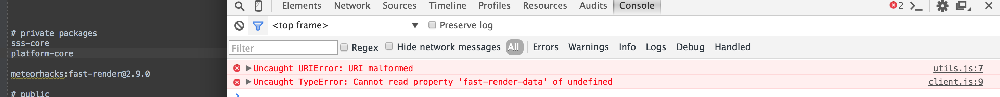
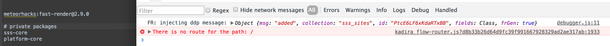

## Error : Cannot read property 'fast-render-data' of undefined

I have already experienced this issue few times.
The solution for this is quite crazy ;].
Change the order of package  **meteorhacks:fast-render** in file `.meteor/packages`.

## Invalid order `.meteor/packages`

## Valid order `.meteor/packages`

I always try to keep **meteorhacks:fast-render** in the top of `.meteor/packages` file.